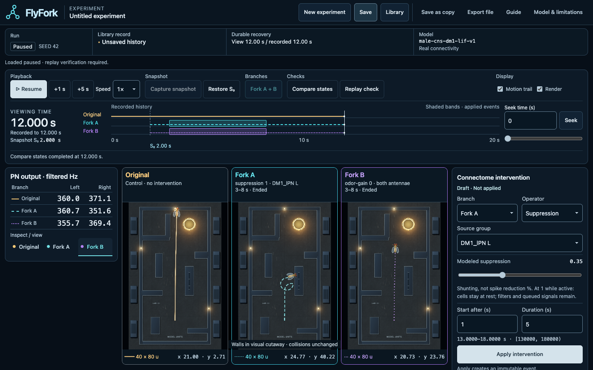

# FlyFork

FlyFork is an open-source browser lab for reproducible experiments on neural circuits derived from fruit-fly connectome data. Capture one complete simulated state, branch it into alternative futures, apply controlled interventions, and compare what changes while preserving the history needed to replay and inspect the experiment.

The question is practical: **what changes when one intervention starts from exactly the same simulated state?** Students can explore controlled comparisons; researchers and developers can inspect the assumptions, reuse the branching machinery, and propose better measurements. The current experimental circuit contains **80 neurons**, not a whole brain.

[Live desktop demo](https://flyfork.org) · [Source and issues](https://github.com/gorkemio/flyfork) · [Usage](docs/usage.md) · [Research](docs/research/overview.md) · [Roadmap](ROADMAP.md)

> **Experimental preview.** Real connectivity does not establish biological validity. Library records stay in your browser: export important experiments as files. There is no account or cloud backup. Desktop Chrome is the primary interaction path; physical phone/tablet and Safari/VoiceOver acceptance remain unconfirmed.

## One state, alternative futures

A connectome describes connections between neurons. FlyFork's selected MaleCNS v1.0 circuit has **4,011 directed neuron-pair edges** containing **30,636 internal synapses**. An edge aggregates the recorded synapses from one selected neuron to another. These counts are anatomical inputs, not measurements of physiological strength.

A snapshot captures neural buffers, delayed signals, random-number streams, filters, body state and measurements. Original, Fork A and Fork B start from that complete state. Interventions have explicit targets, magnitudes and time windows. Original stays the control; the two forks carry their own event histories. Seeking backwards changes the viewing cursor without erasing the recorded future.

**Compare states** asks whether different branches have equal numerical state at the same simulated instant. **Replay check** starts from each branch's own saved beginning and recomputes its recorded history. “Branches differ” and “Replay Matched” can therefore both be correct. Replay checks reproducibility within the tested runtime; it is neither an independent biological experiment nor a promise of identical floating-point results across every runtime.



*Main-branch interface, UI Refinement01-R1. This real recorded experiment has an unnamed workspace and shows calculated state. The live demo is deployed separately and may run an earlier revision.*

## What is real, and what is assumed?

The prepared dataset retains source neuron identifiers, selected cell types, neurotransmitter-sign mapping and raw synapse counts. It includes DM1 olfactory receptor neurons, projection neurons (PNs), and a selected local-neuron group. Most connections to cells outside this selection are cut; missing external circuitry is a substantial limitation.

Leaky integrate-and-fire dynamics—a simplified rule for accumulating voltage and emitting spikes—are assumed. So are sensory drive, the odor field, the world, and the decoder that converts PN activity into body commands. A PN is not a motor neuron. The decoder's speed cap can hide neural differences, so inspect neural output, raw commands, cap time, path and collision stall separately.

Movement is actually simulated from these commands and interactions; it is not prerecorded animation. Visual motion does not validate fly behavior. Read the [model and data provenance](docs/model.md) for boundaries and [research overview](docs/research/overview.md) for measured findings.

## Try a first experiment

1. Open the app and choose **Run guided experiment**.
2. Follow the guide to a snapshot at 2 seconds, then create Fork A and Fork B.
3. Apply the guided interventions: left-PN suppression in A and odor gain zero in B during [3, 8) seconds.
4. Compute to 12 seconds, compare branches and complete the replay check. Wait for each computation to finish.
5. Seek to 5 seconds. Save a named Library record, reload, preview it in Library and load it. Its viewing time is 5 seconds; its recorded frontier remains 12 seconds.
6. Export the record, import it into another browser context and run a fresh Replay check. Seek to 12 seconds to check the full retained history.

The interval notation [3, 8) includes the start and excludes the end. Suppression magnitude is a model operator, not a guaranteed percentage reduction in spikes. [Usage](docs/usage.md) explains manual interventions, keyboard controls and recovery.

## Save deliberately

Library and recovery use browser-local IndexedDB storage, scoped to the browser profile and origin: a different hostname, protocol or port has different records. Export/import transfers explicit JSON files with integrity checks. Important records need external copies; clearing browser data, losing the profile or storage failure can lose local history.

Recovery is a separate bounded slot, with ownership coordinated between tabs where Web Locks are available. It is not continuous, lossless autosave: computations after the last durable checkpoint can be lost. Limits include 120 model seconds, one fork point, three branches, 256 events, 50 named records and 128 MiB of Library payloads, subject to browser quota. See [record format](docs/record-format.md) and [recovery limits](docs/usage.md#recovery-and-failures).

## Run locally

Use **Node.js 24.19.0** and **pnpm 11.25.0** on PATH, with the actual pnpm JavaScript entrypoint. The exact-toolchain check rejects mismatched versions and shell wrappers. No global installer is provided.

```sh
git clone https://github.com/gorkemio/flyfork.git
cd flyfork
node scripts/verify.mjs install
pnpm dev
```

The install command performs a frozen-lockfile install and records actual parent/child tool identities. Open [localhost:5173](http://127.0.0.1:5173). For a production build locally, run `pnpm build`, then `pnpm preview` and open [localhost:4173](http://127.0.0.1:4173). Vite preview is a local check, not a production hosting service.

The prepared data is bundled into the Worker. Normal build and simulation need no runtime LLM, external API, account, simulation backend, Python or raw data download. Optional data-preparation scripts have separate [rebuild boundaries](docs/model.md#optional-data-tools).

## Architecture and verification

React 19.3 and TypeScript 6.0.3 provide the interface; Three.js 0.186 renders the arena. A dedicated Web Worker owns the simulation and experiment commands. Dexie 4.4.6 wraps IndexedDB; Zod 4.6.5 validates records. Vite 8.3 builds the app, Vitest 5.0.1 exercises numerical and record behavior, and Playwright 1.63 drives browser checks. Exact versions remain in [package.json](package.json) and the frozen lockfile.

| Command | Scope |
| --- | --- |
| `pnpm typecheck` / `pnpm lint` | TypeScript and lint checks |
| `pnpm test:unit` | Normal unit/golden suite, including the fixed 24-condition matrix |
| `pnpm test:tooling` | Runner, source packaging and release-payload checks |
| `pnpm build` | Typecheck and production build |
| `pnpm test:smoke` | Existing production-preview record smoke across configured engines |
| `pnpm test:e2e` | Chrome interaction suite; WebKit/Firefox have separate scripts |
| `pnpm source:pack` | Explicit source candidate, manifest and archive |
| `pnpm source:check` | Verify an extracted candidate's hashes, membership and links |

Browser commands require their configured browsers. Every protected run uses fresh evidence destinations. `pnpm test:coverage` is separate: its historical timeout remains a failure, not a required green release claim. Read [verification status](docs/verification.md) before interpreting earlier results. The [English matrix specification](docs/testing/intervention-matrix.md) preserves the original preregistration's conditions and provenance; the generated round-trip fixture retains its original bytes.

## Status and participation

Released branching, recording and replay provide an experimental foundation. Local research has characterized input sensitivity, suppression and decoder masking; external neural benchmarking and anatomical observation mapping remain open. The [roadmap](ROADMAP.md) separates delivered capabilities, retained local evidence and longer-term goals without promised deadlines.

Contributions can improve maintainability, documentation, usability and evidence-backed circuit adapters. Follow [CONTRIBUTING](CONTRIBUTING.md); report vulnerabilities through [SECURITY](SECURITY.md). Original code is [MIT](LICENSE), Copyright (c) 2026 Görkem İnanç Özdemir. Third-party code, data and assets retain [their own licenses](docs/licenses.md). A source push verifies code; [manual image publication and deployment](docs/deployment.md) are separate operations.
